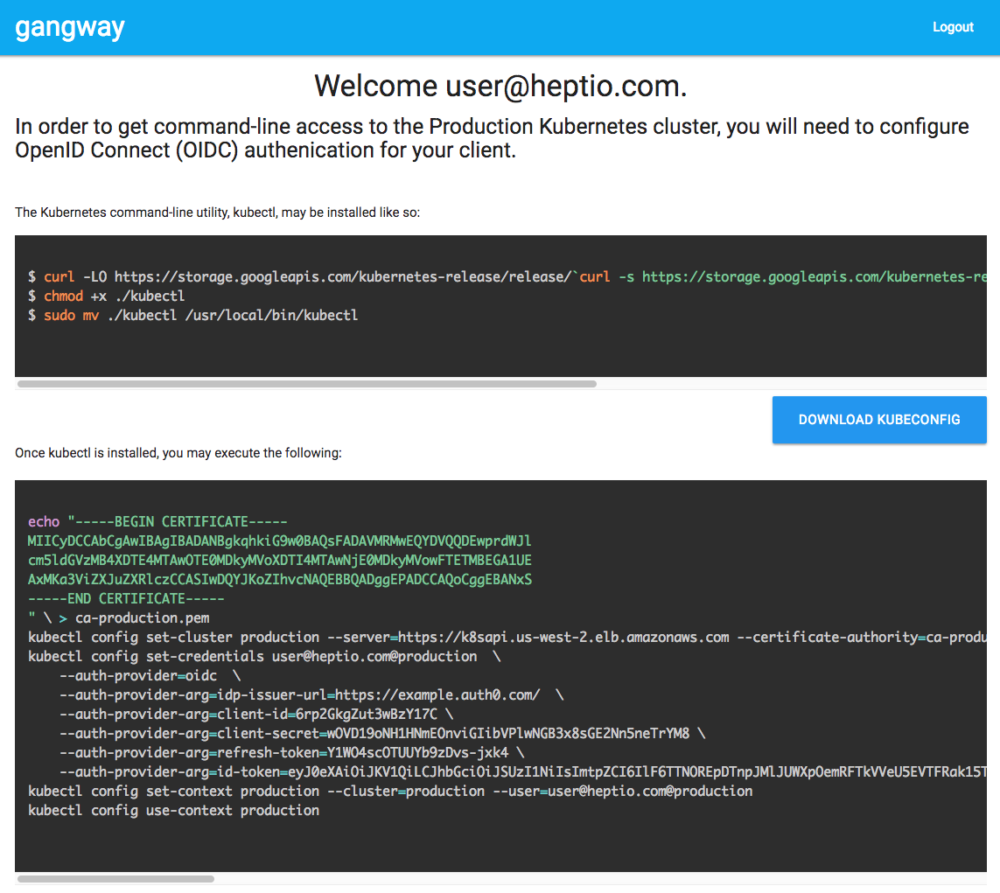

gangway
[](https://travis-ci.org/heptiolabs/gangway)
=======

_(noun): An opening in the bulwark of the ship to allow passengers to board or leave the ship._

An application that can be used to easily enable authentication flows via OIDC for a kubernetes cluster.
Kubernetes supports [OpenID Connect Tokens](https://kubernetes.io/docs/reference/access-authn-authz/authentication/#openid-connect-tokens) as a way to identify users who access the cluster.
Gangway allows users to self-configure their `kubectl` configuration in a few short steps.



## Deployment

Instructions for deploying gangway for common cloud providers can be found [here](docs/README.md).

## API-Server flags

gangway requires that the Kubernetes API server is configured for OIDC:

https://kubernetes.io/docs/admin/authentication/#configuring-the-api-server

```
kube-apiserver
...
--oidc-issuer-url="https://example.auth0.com/"
--oidc-client-id=3YM4ue8MoXgBkvCIHh00000000000
--oidc-username-claim=email
--oidc-groups-claim=groups
```

## Build

Requirements for building

- Go (built with 1.10)
- [esc](https://github.com/mjibson/esc) for static resources.
- [dep](https://github.com/golang/dep) for dependency management.

A Makefile is provided for building tasks. The options are as follows

Getting started is as simple as:
```
$ go get github.com/heptiolabs/gangway
$ cd $GOPATH/src/github.com/heptiolabs/gangway
$ make setup
$ make
```
